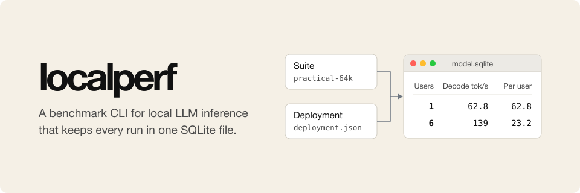

# localperf

<p align="center">
  
</p>

localperf is a benchmark CLI for local LLM inference. It runs a named
benchmark suite against one model deployment and keeps every run of that model
in one SQLite file, from which it renders an HTML report.

localperf is built around llama.cpp. It starts `llama-server` with a GGUF
file, gives it one slot per user in the suite, measures, and stops it again.
It can also measure a server that is already running, and it supports vLLM
for machines that serve with it. The suite says what to measure, and the
deployment says which model and runtime settings to measure it on.

localperf checks the numbers before it reports them. A row labeled "64k
active" means the requests really put about 64k tokens through the KV cache.
Before the first measurement, localperf asks llama-server for its slot count
and per-slot context and refuses a server that is too small for the suite, so
requests never wait in a queue without the report saying so. Every request
gets a unique prefix, so a repeated prompt cannot be answered from the
server's prompt cache.

## Install

Download the archive for your system from the
[releases](https://github.com/osolmaz/localperf/releases) and check it against
`SHA256SUMS` before you unpack `localperf`. Or install it with Go 1.26:

```sh
go install github.com/osolmaz/localperf/cmd/localperf@latest
```

Real runs need a `llama-server` build from
[llama.cpp](https://github.com/ggml-org/llama.cpp/releases), a GGUF model
file, and enough free memory for the model and its KV cache. vLLM runs need
vLLM installed instead. `sqlite3` is useful for looking inside artifacts from
the shell.

## First run

Copy the example deployment. Set `command` to your `llama-server`,
`model_file` to your GGUF file, and `model` to the name the server should
report. Then replace the `replace-with-...` values with the model revision and
the llama.cpp build:

```sh
cp examples/deployments/llama-cpp-managed.json deployment.json
```

A dry run checks the suite and the deployment and writes the exact execution
plan without starting the model:

```sh
localperf bench run --dry-run \
  --suite practical-64k \
  --deployment deployment.json \
  --run-dir /tmp/localperf-practical-dry
localperf artifact check /tmp/localperf-practical-dry.sqlite
```

When the machine is free, run the full suite into the model's artifact, then
render the report or open it in the local viewer:

```sh
localperf bench run --suite practical-64k --deployment deployment.json --timeout 4h \
  --artifact runs/models/<model>.sqlite
localperf artifact render runs/models/<model>.sqlite
localperf view runs/models/<model>.sqlite [runs/models/other.sqlite ...]
```

`view` serves the reports on a temporary local address and puts each artifact
in its own tab.

## Suites

localperf has three built-in suites. Each one fixes its cases, token shapes,
request batches, and convergence policy, so two runs of the same suite measure
the same thing.

| Suite | What it measures |
| --- | --- |
| `practical-64k` | Generation with an almost empty and an almost full 64k context, at 1 and 6 users, and one cold 64k prefill at 1 user. The full-context decode starts from a restored cache, so it measures decode only. |
| `throughput-4k` | Decode throughput at 4k active context with 1, 4, 8, 16, and 32 users. |
| `context-ladder` | Separate decode and prefill cases at 4k, 8k, 16k, 32k, 64k, and 128k active context, with the same user counts up to 64k and 1 and 4 users at 128k. |

localperf sets the server's context size and slot count from the suite cases,
and refuses runtime arguments that try to change them. For llama.cpp it
passes `--parallel` with the largest user count and `--ctx-size` with that
count times the largest context, because llama-server splits the context
across its slots. `practical-64k` therefore starts llama-server with 6 slots
of 64k each. Use `--case` and `--concurrency` only for a small smoke run or a
deliberate subset.

## Deployments

`runtime.type` picks the engine and says whether localperf starts it:

| Type | What localperf does |
| --- | --- |
| `llama-cpp-managed` | Starts `llama-server` with `server.llama_cpp.model_file`, measures, and stops it. |
| `llama-cpp-endpoint` | Measures a `llama-server` that is already running at `endpoint_base_url`. |
| `vllm-managed` | Starts `vllm serve`, measures, and stops it. |
| `vllm-endpoint` | Measures a vLLM server that is already running. |
| `openai-endpoint` | Measures any other OpenAI-compatible server, such as a hosted endpoint. |

A managed llama.cpp deployment sets the model file and the llama-server
options localperf owns under `server.llama_cpp`:

```json
"server": {
  "enable_prefix_caching": false,
  "llama_cpp": {
    "model_file": "/path/to/model.gguf",
    "gpu_layers": 999,
    "flash_attn": "auto",
    "cache_type_k": "q8_0",
    "cache_type_v": "q8_0"
  }
}
```

`batch_size`, `ubatch_size`, and `threads` are also available. Pass other
llama-server flags, such as `--jinja`, in `runtime.args`.

To measure a llama-server that is already running, use
[`llama-cpp-endpoint.json`](examples/deployments/llama-cpp-endpoint.json).
Start the server with `--parallel` set to the suite's largest user count and
`--ctx-size` set to that count times the suite's largest context. localperf
reads both from `GET /props` and stops if either is too small.

vLLM settings go under `server.vllm`; see
[`vllm-managed.json`](examples/deployments/vllm-managed.json). With a vLLM
runtime you can also set `client.load_generator` to `vllm_bench` to drive the
server with `vllm bench serve` instead of localperf's own HTTP client.

Every deployment has a `safety.min_mem_available_gib` floor. localperf reads
the available memory before each step and while the server and load generator
run. When free memory drops below the floor, it stops the current step and
records the step as skipped or failed. Do not lower the floor to make a run
pass.

## Artifacts

An artifact is one SQLite file that holds everything about a model's runs. It
stores the suite and deployment with every measurement and request, along with
GPU telemetry, hardware details, engine identity checks, and the commands and
logs of each step. Pointing `bench run --artifact` at an existing file adds the
new run to it, and running the same run directory again replaces that run.

To combine artifacts that were written separately:

```sh
localperf artifact merge \
  --into runs/models/<model>.sqlite runs/batch-1.sqlite runs/batch-2.sqlite
```

A merge skips runs that are already in the target, and refuses a run whose ID
matches an existing run with different provenance. The report lists every
run and shows each repeated point as mean ± spread.

### Restored context

A decode case with a long context starts every sample from a saved KV cache of
its prompt, so the sample measures decode and not a repeated cold prefill. The
first run of a case on a model primes the cache once and saves it; later runs
reuse the file. Every request must report its prompt as cached, or the sample
fails. Prefill is measured by separate cold cases. This needs llama.cpp; see
[Restored context decode](docs/2026-10-02-restored-context-decode.md).

### Convergence

A point repeats until its throughput is known well enough. Every built-in case
runs at least 3 and at most 10 samples, and stops when the 95% confidence
interval of the mean is within ±5%, or when the next sample would end after
600 seconds. The remaining planned samples are skipped with the reason, and
the report shows the interval and the stop reason in the cell details. A point
that stopped without converging gets a `*` marker. See
[Adaptive convergence](docs/2026-10-02-adaptive-convergence.md).

You can query an artifact directly:

```sh
sqlite3 runs/models/<model>.sqlite \
  "select run_id, workload_id, concurrency, status, aggregate_output_tok_s from measurements"
```

## Context labels

Every suite case says what its context number means. `"active"` means the
requests put about that many tokens through the KV cache. localperf checks
that the input and output land within 90 to 100% of the target. `"capacity"`
means the server's `max_model_len`, which is a limit and says nothing about how
much context a request used. A suite that mixes the two is refused before any
GPU time is spent. [Context Semantics](docs/2026-07-02-context-semantics.md)
has the full rules.

## Prompt cache

The built-in HTTP client adds a short unique prefix to the first user message
of every request, so a repeated prompt cannot hit the server's prompt cache and
report a prefill speed that no cold request reaches. The prefix costs about ten
tokens. With llama.cpp and `enable_prefix_caching` set to `false`, every
request also sends `"cache_prompt": false`, so llama-server does not reuse a
slot's earlier prompt either. To measure prefix reuse on purpose, turn the
prefix off on a case or a workload:

```json
"prompt_nonce": false
```

Requests sent by vLLM's own load generator are outside localperf's control.
See [Prompt Nonces](docs/2026-09-18-prompt-nonces.md) for the details.

## Memory on unified-memory machines

On a machine where the CPU and GPU share memory, such as a Mac or an NVIDIA
DGX Spark, process or cgroup memory does not show what the model really uses.
Compare the drop in available memory with the KV cache size that llama-server
or vLLM logs at startup.
localperf samples GPU use and memory from `tegrastats` and `nvidia-smi` and
names the source in the report. [Measurement
Methods](docs/2026-06-23-measurement-methods.md) explains how memory is
reported.
